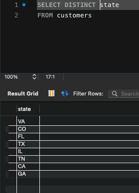

## SQL Basics

### What is a Database?
* A DB is a collection of data stored in an easily accessible format

### What is a Database Management System?
* DBMS is used to execute instructions like querying and modifying data
* DBMS is split into **Relational** and **Non-Relational** DBs

### Relational Databases
* Multiple tables which are related to eachother through shared data
* Below is an example of two separate tables sharing data...

 
 

### SELECT CLAUSE

```bash
USE sql_store; 

SELECT *
FROM customers
WHERE customer_id = 2
ORDER BY first_name
```
1. The database sql_store is chosen
2. The query selects all columns from the customers table
3. Querying based on customer_id being 2
4. the data is then (alphabetically) ordered by the first_name column

```bash
SELECT 
    last_name, 
    first_name, 
    points, 
    points * 10 + 100 AS discount_factor
FROM customers
```
1. Select based on columns
2. Include the points column (int) and another added points column (+10)
3. SQL queries go by order of operations

```bash
SELECT DISTINCT state
FROM customers
```

1. Table contains duplicate items (2 persons with the same 'state' e.g. VA)
2. Distinct option will only reveal unique data (VA once)

 
 

### WHERE CLAUSE

#### Comparison Operators

```bash
SELECT *
FROM Customers
WHERE points > 3000
 ```

```bash
SELECT *
FROM Customers
WHERE birth_date > '1975-01-14'
```
1. Select only where customers are born after 1975-01-14
2. FYI: datetime format must include quotes 

```bash
SELECT *
FROM sql_store.orders
WHERE order_date >= '2019-01-01'
```
1. Selecting for all orders from the year 2019
2. Doing so by equal to or greater than 

### AND, OR Operators

```bash
SELECT *
FROM Customers
WHERE birth_date > '1975-01-14' OR points > 1000
```
1. Only one of the conditions has to be true

```bash
SELECT *
FROM Customers
WHERE birth_date > '1975-01-14' AND points > 1000
```
2. Both conditions have to be true

* The **AND** operator is always operated on first (has higher precedence)
* Parantheses ensures the **OR** operator can go first