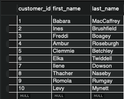

### ORDER BY Operator

* In a Relational Database, every table will have a primary key column.
* The values in that column uniquely identify the records within that table



* customer id is the unique key, by default it is used to **sort** customers 

```bash
SELECT * 
FROM sql_store.customers
ORDER BY state, first_name
```

1. Data is ordered by state (alphabetical) and first_name (ditto)
2. If 2 values are the same (for state) they are sorted by first_name
3. DESC can be used to order in reverse-alphabetical (e.g. first_name DESC) 

* Sorting data by column positions is best avoided 
  * Adding additional data will change the columns
  * Sort by column name instead 

```bash
SELECT first_name, last_name, state
FROM sql_store.customers
ORDER BY 1,2
```


```bash
SELECT *, quantity * unit_price AS total_price
FROM order_items
WHERE order_id = 2
ORDER BY total_price DESC
```
1. Create a new column from quantity and unit_price (total price)
2. Only display from order id where it is 2
3. Order query according to the highest number from total price

### LIMIT Clause

```bash
SELECT *
FROM customers
LIMIT 6, 3
```
1. Skip the first 6 records and ONLY grab the remaining 3