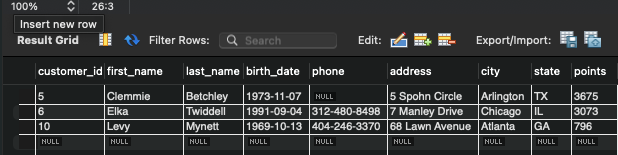

## SQL Basics Pt. 2

### NOT OPERATORS

```bash
SELECT *
FROM Customers
WHERE birth_date > '1975-01-14' OR
    (points > 1000 AND state = 'VA')
```

```bash
SELECT *
FROM Customers
WHERE NOT (birth_date > '1975-01-14' OR points > 1000)
```
1. NOT negates **ALL** of the operators within the query
   1. birth date becomes <= '1975-01-14'
   2. OR becomes AND
   3. points > becomes <=

### IN Operator
```bash
SELECT *
FROM Customers
WHERE state IN ('VA','FL','GA')
```

1. Query for customers where states are from following ('VA','FL','GA')

### BETWEEN Operator

```bash
SELECT *
FROM customers
WHERE points BETWEEN 1000 and 3000
```

1. Operator that is a shortened version of >= 1000 and <= 3000

### LIKE Operator

```bash
SELECT *
FROM customers
WHERE last_name LIKE '%t%'
```

1. Query for customers where the last name contains a 't' (at beginning *or* end)
   1. % any number of characters
   2. _ single character (e.g. __t searches for a name that has 3 characters and *ends* with t)

