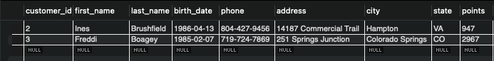

### REGEX Operator

```bash
SELECT *
FROM customers
WHERE last_name REGEXP '^field'
```
1. The above is the same as 'WHERE last_name LIKE 'field%'
2. '$' at end of the string ('field$') is same as '%field'

```bash
SELECT *
FROM customers
WHERE last_name REGEXP 'field|mac|rose'
```
1. Multiple search bar (|) is a logical **or** 
2. It shows multiple search patterns

```bash
SELECT *
FROM customers
WHERE last_name REGEXP '[gim]e'
```

1. Search persons with characters 'g, i or m' at any point in their name before 'e'



- ^ beginning
- $ end
- | logical or expression
- [abcd] containing any these characters
- [a-h] containing any characters between a to h

```bash
SELECT *
FROM customers
WHERE last_name REGEXP 'B[R]|B[U]'
```

1. Search for persons where last name has a B and is followed by R or U

### Searching for Missing Values